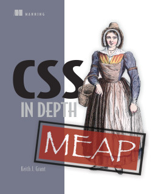

# CSS in Depth
Code listings from [CSS In Depth](https://manning.com/books/css-in-depth) by Keith J. Grant

It is generally a best practice to link to stylesheets external to your HTML. I have not done this in these examples for ease of reading. Instead, I have included the CSS for each listing in the page's head using style tags.

Throughout the book, the HTML and CSS are shown in two separate listings. The examples files here are named for the listing of the CSS. For example, listing 1.1 in Chapter one shows some CSS, which is meant to be applied to the HTML in listing 1.2.  The resulting example can be found in ch01/listing-1.1.html.
